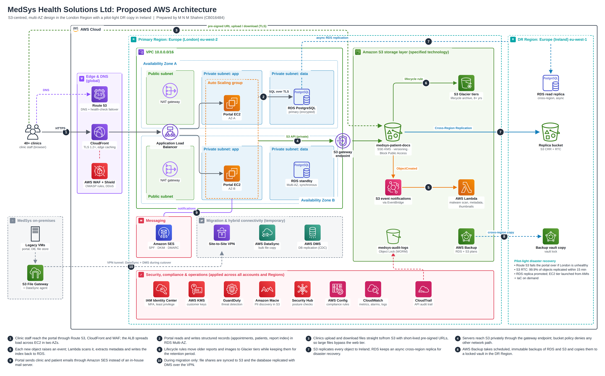

# MedSys Health Solutions – AWS Cloud Architecture

Cloud consultancy project for **COMP50061 Cloud Infrastructure & Design**
(APIIT / University of Staffordshire) by **Malan De Mel**.

   

## The Scenario
MedSys is a private healthcare provider supporting 40+ clinics through a web portal
for appointments, patient records and diagnostic reports. Its on-premises setup of
legacy servers, manual backups and a small IT team struggles with busy periods,
growing file storage and security threats.

## The Solution
- **Amazon S3** at the centre for all patient documents and medical images
- Web portal on **EC2 Auto Scaling** across two Availability Zones in London
- **RDS PostgreSQL Multi-AZ** for structured data
- Backups that can't be altered, using S3 Object Lock and AWS Backup
- Disaster-recovery copy in the **Ireland** Region
- Security with WAF, GuardDuty, Macie, KMS and IAM Identity Center

## AWS Services Used
| Area | Services |
|------|----------|
| Storage | Amazon S3, S3 Glacier, AWS Backup |
| Compute | EC2, Auto Scaling, Lambda |
| Database | Amazon RDS (PostgreSQL) |
| Network | VPC, Route 53, CloudFront, ALB |
| Security | WAF, Shield, KMS, GuardDuty, Macie, CloudTrail |
| Email | Amazon SES |
| Migration | DataSync, DMS, Site-to-Site VPN |

## Migration Plan
1. Plan and set up AWS foundations
2. Move files to S3 first
3. Quick wins (email, backups)
4. Build and test the new portal
5. Overnight cutover, then optimise

## Report
   - [Read the report (PDF)](Medsys-AWS-Architecture/Report/MedSys_Cloud_Report.pdf)
   - [Download Word version](Medsys-AWS-Architecture/Report/MedSys_Cloud_Report.docx)
